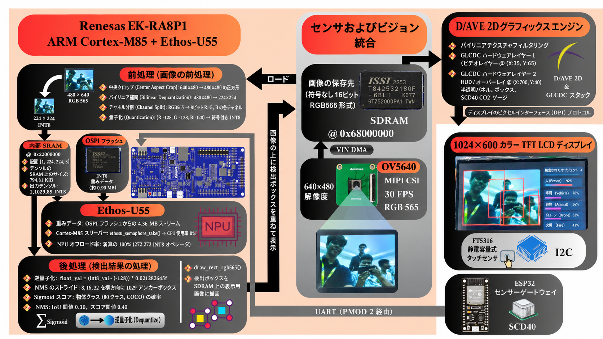

[English](./README_EN.md) | 日本語

# RA8P1 エッジAIアシスティブシステム

ルネサス **EK-RA8P1** マイクロコントローラ上に実装された物理リアルタイム・エッジAIアシスティブシステム。**μT-Kernel 3.0（TRON RTOS）**、**YOLOX-Tiny INT8**、および **Arm Ethos-U55 NPU** を中核とし、外部センサーテレメトリおよびハードウェアアクセラレーションによる2Dグラフィックスを統合しています。

**TRONプログラミングコンテスト2026** 応募作品。

---

## システムアーキテクチャ



本システムは、μT-Kernel 3.0 の優先度ベース・プリエンプティブマルチタスキングを活用し、ルネサス RA8P1 のヘテロジニアス構成全体で並行かつジッターフリーなパイプラインを実行します：
* **カメラキャプチャ:** ハードウェア CEU/VIN DMA により、CPU を介さずに 30 FPS の映像を外部 SDRAM へ直接ストリーミング転送します。
* **AIニューラルアクセラレーション:** Arm Ethos-U55-256 NPU が 272 個の INT8 テンソル演算を自律的に実行。μT-Kernel の計数セマフォ（`tk_wai_sem` / `tk_sig_sem`）により、推論実行中の CPU 負荷 0% を実現しています。
* **グラフィックス描画:** ルネサス DAVE2D ハードウェアアクセラレータにより、CPU 負荷ゼロでビデオフレームのブリット（転送）および GLCDC ディスプレイへの透過 GUI オーバーレイ描画を行います。
* **テレメトリおよびタッチ入力:** 専用のバックグラウンド RTOS タスクが、UART 経由での Sensirion SCD40 環境テレメトリ（CO₂濃度、温度、湿度）の受信および FT5316 静電容量式タッチイベントの処理を担当します。

---

## AIモデルのソースとアクセラレーション

ビジョン検出パイプラインは、マイクロ NPU 向けに最適化および量子化された **YOLOX-Tiny** をベースとして構築されています：

* **ベースモデルアーキテクチャおよびアルゴリズム:** [Megvii-BaseDetection/YOLOX](https://github.com/Megvii-BaseDetection/YOLOX)
* **MCUデプロイおよび量子化リファレンス:** [Renesas RUHMI Model Zoo — YOLOX-Tiny](https://github.com/renesas/ruhmi-model-zoo/blob/main/vision/object_detection/yolox_tiny/README.md)

### コンパイルおよび NPU オフロード:
* **量子化:** 対称パーテンソル重みおよび活性化関数を用いた INT8 学習後量子化（PTQ）。
* **コンパイラ:** `Shared_Sram` メモリ構成にて `ethos-u55-256` をターゲットとした Arm Vela コンパイラ。
* **NPU実行:** **全 272 オペレータ中 272 個（100% オフロード）** が Arm Ethos-U55 ハードウェアコプロセッサ上で動作し、CPU フォールバック演算はゼロです。
* **重みストレージ:** 4.36 MB の圧縮済み INT8 重みを外部 Octal-SPI フラッシュ（`0x90000000`, `.ospi0_cs1`）に格納し、高速 Octal DDR モードで実行します。

---

## リポジトリ構造

```text
RA8P1-Edge-AI-Assistive-System/
├── assets/                   # アーキテクチャ図および設計スキーマティック
│   ├── system_architecture.png       # システムアーキテクチャ図 (英語)
│   └── system_architecture_ja.png    # システムアーキテクチャ図 (日本語)
├── e2studio_project/         # 公式 Renesas e² studio ワークスペース＆プロジェクト
│   ├── README.md             # ガイド: インポート、ビルド、デバッグ、およびRTT設定
│   └── TRON_V_01/            # 完全な e² studio プロジェクト (μT-Kernel 3.0 + AIパイプライン)
├── sensor_gateway/           # ESP32 + Sensirion SCD40 テレメトリノードファームウェア
│   ├── README.md             # センサー配線、ピン配置、およびUARTプロトコル仕様
│   └── sensor_gateway.ino    # CO2/温度/湿度データ送信用 Arduinoスケッチ
├── docs/                     # 技術レポートおよびアーキテクチャ正当化文書
│   ├── TRON_2026_Project_Presentation.pdf                   # プロジェクトプレゼンテーション資料 (スライド)
│   ├── uT-Kernel_3.0_Architectural_Significance_Report.pdf   # 公式PDFレポート
│   └── uT-Kernel_3.0_Architectural_Significance_Report.md    # オンラインMarkdownレポート
├── LICENSE                   # オープンソースライセンス
├── README.md                 # システム概要およびポータル (日本語)
└── README_EN.md              # システム概要およびポータル (英語)
```

---

## クイックスタートガイド

### 1. e² studio プロジェクトのセットアップ
詳細な手順は [`e2studio_project/README.md`](./e2studio_project/README.md) を参照してください：
1. **e² studio** を起動し、**ファイル ➔ インポート ➔ 一般 ➔ 既存のプロジェクトをワークスペースへ** を選択します。
2. [`e2studio_project/TRON_V_01`](./e2studio_project/TRON_V_01) を選択します。
3. `Debug` 構成をビルドします（`Ctrl + B`）。
4. オンボード J-Link を使用し、`TRON_V_01 Debug_Flat` でフラッシュへの書き込みおよびデバッグを実行します。
5. **SEGGER J-Link RTT Viewer** をターゲット `R7FA8P1BH` に接続し、以下の RTT アドレスを指定します：
   ```
   0x22086d98
   ```
   *（※ビルド環境でアドレスが異なる場合は、`Debug/TRON_V_01.map` 内の `_SEGGER_RTT` を検索してください）*。

### 2. センサーゲートウェイのセットアップ
ハードウェア接続および構成の詳細は [`sensor_gateway/README.md`](./sensor_gateway/README.md) を参照してください：
1. Sensirion SCD40 を I2C 経由で ESP32 に接続します（SDA ➔ GPIO 22、SCL ➔ GPIO 21）。
2. ESP32 の UART を EK-RA8P1 の拡張ヘッダー J4（Pin 8 RXD0、Pin 4 TXD0、Pin 19 GND）または Pmod 2 に接続します。
3. Arduino IDE を使用して [`sensor_gateway/sensor_gateway.ino`](./sensor_gateway/sensor_gateway.ino) を書き込みます。

---

## μT-Kernel 3.0 技術報告書（アーキテクチャの重要性）

μT-Kernel 3.0 の活用方法、完全な API カタログ（`tk_*`）、タスク優先度マトリクス、セマフォによるゼロウェイト NPU ドライバ連携、メモリマップ、キャッシュコヒーレンシ戦略に関する詳細な分析については、以下を参照してください：

* **[公式PDFレポートをダウンロード (.pdf)](./docs/uT-Kernel_3.0_Architectural_Significance_Report.pdf)** 
* **[オンライン技術報告書（Markdown）](./docs/uT-Kernel_3.0_Architectural_Significance_Report.md)**

---

## プロジェクトプレゼンテーション（PPT）

* **[プロジェクトプレゼンテーション資料（PDF）を表示 / ダウンロード](./docs/TRON_2026_Project_Presentation.pdf)**
* **[Google Drive でプレゼンテーション資料（PPT / PDF）を表示](https://drive.google.com/drive/folders/1aq13WN0o9cSi9gnxYKWx7etrO9hVEVe0?usp=sharing)**

---

## プロトタイプ実演デモ動画

* **[プロトタイプ実演デモ動画を視聴（Google Drive）](https://drive.google.com/drive/folders/1aq13WN0o9cSi9gnxYKWx7etrO9hVEVe0?usp=sharing)**
* **[（Youtube）](https://www.youtube.com/watch?v=3BoIJLrtEzs)**

---

## 謝辞 (Acknowledgements)

TRONプログラミングコンテスト2026への参加の機会をいただきました **TRONフォーラムの皆様**、ならびに **ルネサス エレクトロニクス株式会社様** に心より御礼申し上げます。

ルネサス EK-RA8P1 プラットフォームおよび μT-Kernel 3.0 を用いた組み込みシステム開発を探求し、実践的な経験を積むためのプラットフォーム、リソース、そして手厚いサポートを提供していただきましたことに深く感謝いたします。本機会を通じて、組み込みシステム設計における技術的知識を深め、スキルを大幅に向上させることができました。

学生の学習、イノベーション、そして組み込みシステムコミュニティへの貢献を温かく後押しし、本コンテストの開催と運営にご尽力いただいたすべての関係者の皆様に、心より感謝申し上げます。

---

## ライセンス

本プロジェクトはオープンソースソフトウェアです：
* アプリケーションコード、ESP32 センサーゲートウェイファームウェア、RTOS タスク、およびドキュメントは [MIT License](./LICENSE) に基づいてライセンス供与されています。
* μT-Kernel 3.0 OS カーネルおよび BSP ファイルは、TRONフォーラムによる [T-License 2.2](https://www.tron.org/page-6047/) に基づいて配布されています。
* YOLOX-Tiny ベースモデルアーキテクチャは、Megvii Technology による [Apache License 2.0](http://www.apache.org/licenses/LICENSE-2.0) に基づいて配布されています。
* ルネサス FSP ドライバおよび HAL コンポーネントは、ルネサス ソフトウェア使用許諾契約に基づいてライセンス供与されています。
