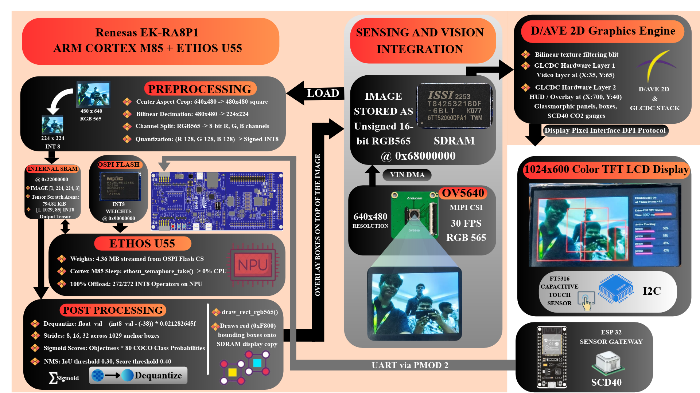

English | [日本語](./README.md)

# RA8P1 Edge AI Assistive System

A physical real-time Edge AI assistive system deployed on the **Renesas EK-RA8P1** microcontroller, powered by **μT-Kernel 3.0 (TRON RTOS)**, **YOLOX-Tiny INT8**, and the **Arm Ethos-U55 NPU**, integrated with external sensor telemetry and hardware-accelerated 2D graphics.

Submitted for the **TRON Programming Contest 2026**.

---

## System Architecture



The system leverages μT-Kernel 3.0 priority-preemptive multitasking to run concurrent, zero-jitter pipelines across the Renesas RA8P1 heterogeneous architecture:
* **Camera Capture:** Hardware CEU/VIN DMA directly streams 30 FPS video into external SDRAM without CPU intervention.
* **AI Neural Acceleration:** Arm Ethos-U55-256 NPU executes 272 INT8 tensor operators autonomously with 0% CPU load via μT-Kernel counting semaphores (`tk_wai_sem` / `tk_sig_sem`).
* **Graphics Rendering:** Renesas DAVE2D hardware blits video frames and renders transparent GUI overlays directly to the GLCDC display.
* **Telemetry & Touch:** Dedicated background RTOS tasks ingest Sensirion SCD40 environmental telemetry (CO₂, temperature, humidity) over UART and FT5316 capacitive touch events.

---

## AI Model Sources & Acceleration

The vision detection pipeline is built upon **YOLOX-Tiny**, optimized and quantized for micro-NPUs:

* **Base Model Architecture & Algorithm:** [Megvii-BaseDetection/YOLOX](https://github.com/Megvii-BaseDetection/YOLOX)
* **MCU Deployment & Quantization Reference:** [Renesas RUHMI Model Zoo — YOLOX-Tiny](https://github.com/renesas/ruhmi-model-zoo/blob/main/vision/object_detection/yolox_tiny/README.md)

### Compilation & NPU Offload:
* **Quantization:** INT8 post-training quantization with symmetric per-tensor weights and activations.
* **Compiler:** Arm Vela compiler targeting `ethos-u55-256` with `Shared_Sram` memory configuration.
* **NPU Execution:** **100% offload (272 of 272 operators)** run on the Arm Ethos-U55 hardware co-processor with zero CPU fallback operators.
* **Weights Storage:** 4.36 MB compressed INT8 weights stored in external Octal-SPI Flash (`0x90000000`, `.ospi0_cs1`) executed in high-speed Octal DDR mode.

---

## Repository Structure

```text
RA8P1-Edge-AI-Assistive-System/
├── assets/                   # Architectural diagrams and design schematics
│   ├── system_architecture.png       # System Architecture Diagram (English)
│   └── system_architecture_ja.png    # System Architecture Diagram (Japanese)
├── e2studio_project/         # Official Renesas e² studio workspace & project
│   ├── README.md             # Guide: Importing, building, debugging, & RTT setup
│   └── TRON_V_01/            # Complete e² studio project (μT-Kernel 3.0 + AI Pipeline)
├── sensor_gateway/           # ESP32 + Sensirion SCD40 telemetry node firmware
│   ├── README.md             # Sensor wiring, pinouts, and UART protocol specification
│   └── sensor_gateway.ino    # Arduino sketch for CO2/Temp/Humidity broadcasting
├── docs/                     # Technical reports and architectural justification
│   ├── TRON_2026_Project_Presentation.pdf                   # Project presentation slides
│   ├── uT-Kernel_3.0_Architectural_Significance_Report.pdf   # Official PDF Report
│   └── uT-Kernel_3.0_Architectural_Significance_Report.md    # Online Markdown Report
├── LICENSE                   # Open-source license
├── README.md                 # System overview and entry portal (Japanese)
└── README_EN.md              # System overview and entry portal (English)
```

---

## Quick Start Guide

### 1. e² studio Project Setup
Refer to [`e2studio_project/README.md`](./e2studio_project/README.md) for full instructions:
1. Open **e² studio** and choose **File ➔ Import ➔ General ➔ Existing Projects into Workspace**.
2. Select [`e2studio_project/TRON_V_01`](./e2studio_project/TRON_V_01).
3. Build the `Debug` configuration (`Ctrl + B`).
4. Flash and debug via on-board J-Link using `TRON_V_01 Debug_Flat`.
5. Connect **SEGGER J-Link RTT Viewer** to target `R7FA8P1BH` at RTT address:
   ```
   0x22086d98
   ```
   *(If the address does not match your build, search for `_SEGGER_RTT` in `Debug/TRON_V_01.map`)*.

### 2. Sensor Gateway Setup
Refer to [`sensor_gateway/README.md`](./sensor_gateway/README.md) for hardware schematics and setup:
1. Connect Sensirion SCD40 to ESP32 via I2C (SDA ➔ GPIO 22, SCL ➔ GPIO 21).
2. Connect ESP32 UART to EK-RA8P1 Header J4 (Pin 8 RXD0, Pin 4 TXD0, Pin 19 GND) or Pmod 2.
3. Flash [`sensor_gateway/sensor_gateway.ino`](./sensor_gateway/sensor_gateway.ino) using the Arduino IDE.

---

## μT-Kernel 3.0 Architectural Significance & Technical Report

For in-depth analysis of how **μT-Kernel 3.0** is utilized, including the complete API catalog (`tk_*`), task priority matrices, zero-wait NPU semaphore driver binding, memory maps, and cache coherence strategies:

* **[Download Official PDF Report (.pdf)](./docs/uT-Kernel_3.0_Architectural_Significance_Report.pdf)** 
* **[Online Technical Significance Report (Markdown)](./docs/uT-Kernel_3.0_Architectural_Significance_Report.md)**

---

## Project Presentation (PPT)

* **[Download / View Project Presentation PDF](./docs/TRON_2026_Project_Presentation.pdf)**
* **[View Project Presentation on Google Drive](https://drive.google.com/drive/folders/1aq13WN0o9cSi9gnxYKWx7etrO9hVEVe0?usp=sharing)**

---

## Prototype Demonstration Video

* **[Watch Prototype Demonstration Video (Google Drive)](https://drive.google.com/drive/folders/1aq13WN0o9cSi9gnxYKWx7etrO9hVEVe0?usp=sharing)**

---

## Acknowledgements

We would like to express our sincere gratitude to the **TRON Forum team** and **Renesas Electronics** for providing us with the opportunity to participate in the TRON Programming Contest 2026.

We are grateful for the platform, resources, and support provided to explore embedded systems development and gain practical experience with the Renesas EK-RA8P1 platform and μT-Kernel 3.0. This opportunity has helped us strengthen our technical knowledge and develop our skills in embedded system design.

We sincerely thank everyone involved in organizing and supporting this contest for encouraging students to learn, innovate, and contribute to the embedded systems community.

---

## License

This project is open-source software:
* Application code, ESP32 sensor gateway firmware, RTOS tasks, and documentation are licensed under the [MIT License](./LICENSE).
* The μT-Kernel 3.0 OS kernel and BSP files are distributed under the [T-License 2.2](https://www.tron.org/page-6047/) by TRON Forum.
* The YOLOX-Tiny base model architecture is distributed under the [Apache License 2.0](http://www.apache.org/licenses/LICENSE-2.0) by Megvii Technology.
* Renesas FSP drivers and HAL components are licensed under the Renesas Software License Agreement.
